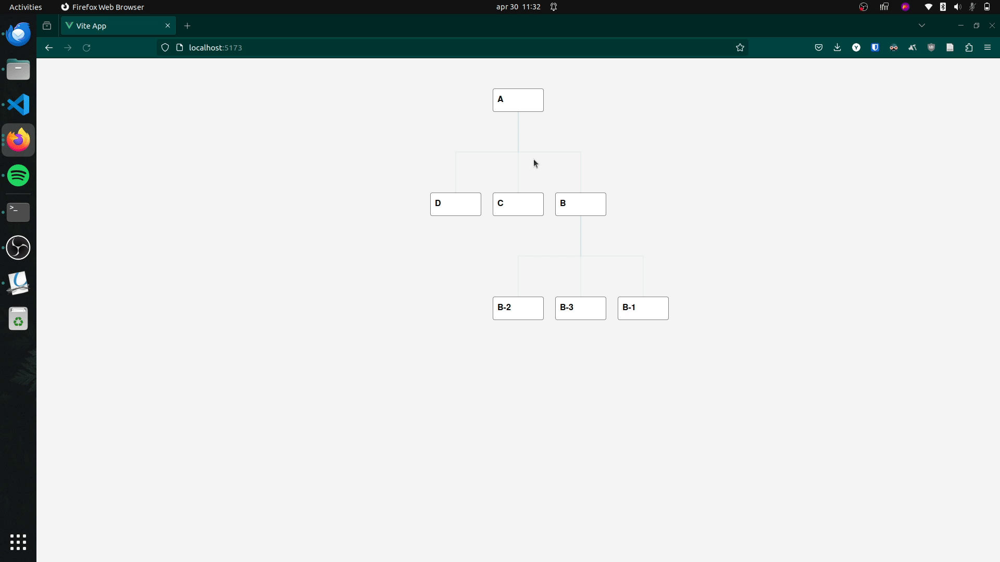
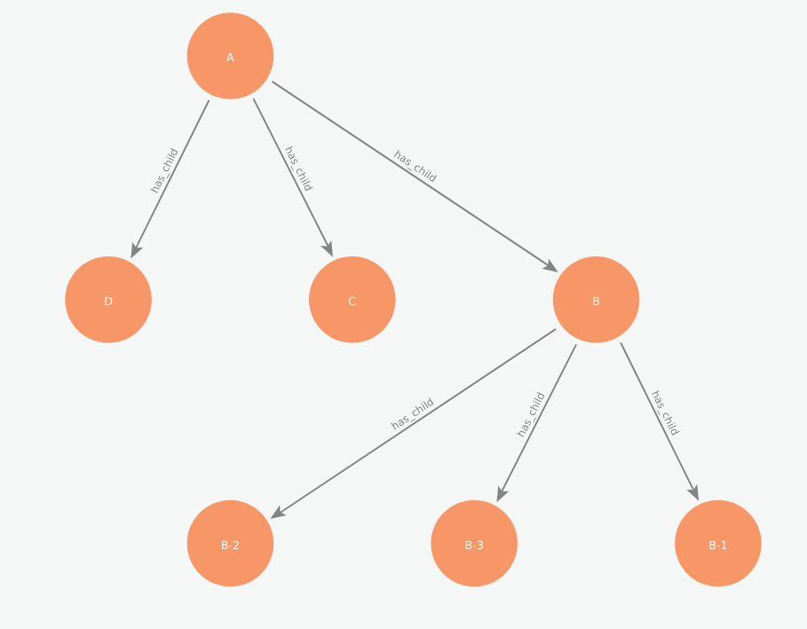

# ABN-AMRO Coding Challenge (Full Stack Developer)



For the Junior Full Stack Developer position at ABN-AMRO I was tasked to create a small data-related project. This repository contains that application.

## Introduction

To satisfy the forntend and backend requirements, I have separated them into two directories: the [frontend](./frontend/) and [backend](./backend/) applications.

## Backend

The backend is an Express.js based server. It can be run by entering the directory and running:

```shell
npm install
npm run start
```

The backend connects to a Neo4j graph database instance, which is where it retrieves the data we were provided. Neo4j is a popular graph database often used to store nodes and relations much like the data used here.



The backend uses Postman to test the most basic functionalities (getting a 200 response, validating the node structure). These tests can be run by using the Postman collection found within the [./backend/tests](./backend/tests) directory and importing it into [Postman](https://www.postman.com/).

## Frontend

The frontend is a Vue.js web application. It can be run by entering the directory and running:

```shell
npm install
npm run start
```

It makes use of a visualization library built on top of D3.js (@ssthouse/vue3-tree-chart), to make use of the tree chart without the boilerplate code that would normally be required.

The frontend uses Cypress to test the most basic functionalities (selecting and deselecting nodes). These tests can be run by entering the directory and running:

```shell
npm run test:e2e:dev
```

The frontend also makes use of eslint and prettier to maintain a consistent programming style throughout the project.

## User story

As a user, I would like to see the hierarchy of the provided data.

### Acceptance

Done | Requirement | Reasoning
:------------ | :-------------| :-------------|
:heavy_check_mark: | Clicking one of the nodes displays the detail of that node | The details of a node are shown on top when clicked
:heavy_check_mark: | Selected node should be visible on the layout | Selected node is indicated by a contrasting colored border
:heavy_check_mark: | Description and the name should be visible in a sidebar or popup | The description and name are shown as a popup above the chart
:heavy_check_mark: | Hierarchy should be visible and understandable by the user | Hierachy is visible through a tree structure
:heavy_check_mark: | Tree layout could be from top to bottom or left to right | Tree layout is vertical (top to bottom). It could be turned horizontal by changing a single variable.
:heavy_check_mark: | User should be able to deselect a node | User can click the selected node again to deselect it

## Assumptions

The "non-functional requirements" specified that the GET endpoint should "serve the data with the correct hierarchy" (paraphrased). Because this was performed over the weekend, I could not ask for clarification. Given that statement, I assumed it was talking about the JSON object having a structure much like a parent object having children and those children also being able to have children, etc. Because of that, I created the query found in [neo4j_calls.js](./backend/neo4j_calls.js) to do specifically that. This is however not necessarily how Neo4j requests are meant to be used. Normally I would parse the request into the proper format on the frontend, but given this requirement, I felt that it would be a fun challenge to format it before sending. For future projects I would clarify what was meant by "correct hierarchy".
